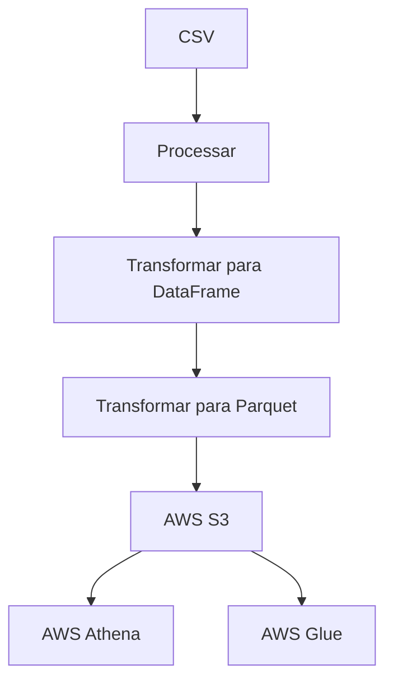

# Processamento de dados
Este documento descreve o fluxo de processamento de dados desde um arquivo CSV até o armazenamento em um bucket do AWS S3. O processo envolve diversas etapas de transformação e integração com serviços da AWS.

### Etapas do Fluxo

1. **Processar CSV**
   - O processo inicia com a leitura de um arquivo CSV, que contém os dados brutos.

2. **Transformar para DataFrame**
   - Os dados do CSV são transformados em um DataFrame, facilitando a manipulação e análise.

3. **Transformar para Parquet**
   - O DataFrame é então convertido para o formato Parquet, que é mais eficiente para armazenamento e consultas.

4. **Enviar para o S3**
   - Finalmente, os dados em formato Parquet são enviados para um bucket no AWS S3, onde podem ser armazenados e acessados.

### Integração com AWS

- **AWS Athena**
  - Utilizado para realizar consultas SQL diretamente sobre os dados armazenados no S3, permitindo análises rápidas.

- **AWS Glue**
  - Serviço de ETL (Extração, Transformação e Carga) que facilita a preparação e o carregamento de dados para análise.

## Tecnologias Utilizadas

- Python
- Pandas
- AWS Services (S3, Athena, Glue)